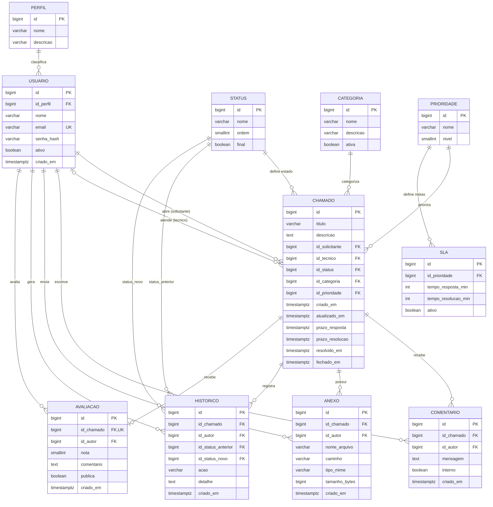

# 🗄️ Modelo de Dados (ER) — Sistema de Chamados

Modelagem **conceitual/lógica** do banco de dados. O schema físico será gerado na
**Fase 1** via *migrations* do **Entity Framework Core** sobre **PostgreSQL**
(ver [Decisões de Arquitetura](../README.md#-decisões-de-arquitetura)).

**Convenções**
- Chaves primárias: `bigint` auto-incremental (`identity`), nomeadas `id`.
- Chaves estrangeiras: `id_<entidade>` (ex.: `id_chamado`).
- Datas/hora em UTC (`timestamptz`).
- `Status`, `Categoria` e `Prioridade` são **tabelas de domínio** (configuráveis pelo Administrador), não *enums* fixos.

---

## Diagrama ER

---

## Dicionário de Dados

### PERFIL
Papel de acesso do usuário. Registros de referência: **Administrador**, **Técnico**, **Cliente**.

| Campo | Tipo | Nulo | Chave | Observação |
|-------|------|------|-------|------------|
| id | bigint | não | PK | Auto-incremental |
| nome | varchar(50) | não | UK | Ex.: Administrador, Técnico, Cliente |
| descricao | varchar(255) | sim | | Descrição do papel |

### USUARIO
Pessoa que acessa o sistema (cliente, técnico ou admin), sempre vinculada a um perfil.

| Campo | Tipo | Nulo | Chave | Observação |
|-------|------|------|-------|------------|
| id | bigint | não | PK | |
| id_perfil | bigint | não | FK → PERFIL | |
| nome | varchar(120) | não | | |
| email | varchar(160) | não | UK | Login |
| senha_hash | varchar(255) | não | | Hash (nunca senha em texto puro) |
| ativo | boolean | não | | Default `true` |
| criado_em | timestamptz | não | | Default `now()` |

### STATUS
Estado do chamado (tabela de domínio). Ex.: Aberto, Em Atendimento, Aguardando Cliente, Resolvido, Fechado.

| Campo | Tipo | Nulo | Chave | Observação |
|-------|------|------|-------|------------|
| id | bigint | não | PK | |
| nome | varchar(50) | não | UK | |
| ordem | smallint | não | | Ordem de exibição no fluxo |
| final | boolean | não | | Marca estados terminais (Resolvido/Fechado) |

### CATEGORIA
Assunto/tipo do chamado (tabela de domínio). Ex.: Hardware, Software, Rede, Acesso, A Triar
(atribuída automaticamente a chamados abertos por Cliente, que não escolhe categoria).

| Campo | Tipo | Nulo | Chave | Observação |
|-------|------|------|-------|------------|
| id | bigint | não | PK | |
| nome | varchar(80) | não | UK | |
| descricao | varchar(255) | sim | | |
| ativa | boolean | não | | Default `true` |

### PRIORIDADE
Nível de urgência (tabela de domínio). Ex.: Baixa, Média, Alta, Crítica.

| Campo | Tipo | Nulo | Chave | Observação |
|-------|------|------|-------|------------|
| id | bigint | não | PK | |
| nome | varchar(50) | não | UK | |
| nivel | smallint | não | | Peso numérico (maior = mais urgente) |

### SLA
Metas de atendimento por prioridade (usadas para calcular prazos do chamado).

| Campo | Tipo | Nulo | Chave | Observação |
|-------|------|------|-------|------------|
| id | bigint | não | PK | |
| id_prioridade | bigint | não | FK → PRIORIDADE | |
| tempo_resposta_min | int | não | | Minutos para 1ª resposta |
| tempo_resolucao_min | int | não | | Minutos para resolução |
| ativo | boolean | não | | Default `true` |

### CHAMADO
Entidade central — a solicitação de suporte e seu ciclo de vida.

| Campo | Tipo | Nulo | Chave | Observação |
|-------|------|------|-------|------------|
| id | bigint | não | PK | |
| titulo | varchar(160) | não | | |
| descricao | text | não | | |
| id_solicitante | bigint | não | FK → USUARIO | Cliente que abriu |
| id_tecnico | bigint | sim | FK → USUARIO | Técnico responsável (atribuído depois) |
| id_status | bigint | não | FK → STATUS | |
| id_categoria | bigint | não | FK → CATEGORIA | |
| id_prioridade | bigint | não | FK → PRIORIDADE | |
| criado_em | timestamptz | não | | Default `now()` |
| atualizado_em | timestamptz | não | | Atualizado a cada mudança |
| prazo_resposta | timestamptz | sim | | Calculado a partir do SLA |
| prazo_resolucao | timestamptz | sim | | Calculado a partir do SLA |
| primeira_resposta_em | timestamptz | sim | | Preenchido no 1º comentário de técnico/admin — satisfaz o SLA de resposta |
| resolvido_em | timestamptz | sim | | Preenchido ao resolver |
| fechado_em | timestamptz | sim | | Preenchido ao fechar |

### COMENTARIO
Mensagens trocadas dentro do chamado.

| Campo | Tipo | Nulo | Chave | Observação |
|-------|------|------|-------|------------|
| id | bigint | não | PK | |
| id_chamado | bigint | não | FK → CHAMADO | |
| id_autor | bigint | não | FK → USUARIO | |
| mensagem | text | não | | |
| interno | boolean | não | | `true` = nota interna (só técnicos/admin) |
| criado_em | timestamptz | não | | Default `now()` |

### ANEXO
Arquivos anexados a um chamado. O binário fica em disco/storage; a tabela guarda os metadados.

| Campo | Tipo | Nulo | Chave | Observação |
|-------|------|------|-------|------------|
| id | bigint | não | PK | |
| id_chamado | bigint | não | FK → CHAMADO | |
| id_autor | bigint | não | FK → USUARIO | |
| nome_arquivo | varchar(255) | não | | Nome original |
| caminho | varchar(500) | não | | Local no storage |
| tipo_mime | varchar(100) | não | | Ex.: image/png |
| tamanho_bytes | bigint | não | | |
| criado_em | timestamptz | não | | Default `now()` |

### HISTORICO
Trilha de auditoria: cada mudança de status/ação relevante no chamado.

| Campo | Tipo | Nulo | Chave | Observação |
|-------|------|------|-------|------------|
| id | bigint | não | PK | |
| id_chamado | bigint | não | FK → CHAMADO | |
| id_autor | bigint | não | FK → USUARIO | Quem executou a ação |
| id_status_anterior | bigint | sim | FK → STATUS | Nulo na abertura |
| id_status_novo | bigint | sim | FK → STATUS | |
| acao | varchar(80) | não | | Ex.: "Abertura", "Mudança de status", "Atribuição" |
| detalhe | text | sim | | Descrição livre da alteração |
| criado_em | timestamptz | não | | Default `now()` |

### AVALIACAO
Avaliação do atendimento, feita pelo Cliente solicitante após o chamado ser finalizado. Um chamado só pode ter uma avaliação.

| Campo | Tipo | Nulo | Chave | Observação |
|-------|------|------|-------|------------|
| id | bigint | não | PK | |
| id_chamado | bigint | não | FK → CHAMADO, UK | Um chamado tem no máximo uma avaliação |
| id_autor | bigint | não | FK → USUARIO | Sempre o Cliente solicitante |
| nota | smallint | não | | Nota de 0 a 5 |
| comentario | text | sim | | |
| publica | boolean | não | | Default `false`. `true` = também visível ao técnico atribuído |
| criado_em | timestamptz | não | | Default `now()` |

---

## Notas de Modelagem

- **Dois vínculos Usuário → Chamado:** `id_solicitante` (obrigatório, o cliente) e `id_tecnico` (opcional, atribuído durante o atendimento).
- **Domínios configuráveis:** `Status`, `Categoria` e `Prioridade` são tabelas para permitir que o Administrador gerencie os valores sem alterar código.
- **SLA por prioridade:** os prazos (`prazo_resposta`/`prazo_resolucao`) são derivados do SLA vigente da prioridade no momento da abertura e persistidos no chamado, preservando a meta histórica mesmo que o SLA mude depois.
- **Anexos:** apenas metadados no banco; o conteúdo é armazenado fora (pasta `/uploads` já ignorada no `.gitignore`).
- **Histórico:** append-only (nunca atualizado/removido), garantindo trilha de auditoria completa das mudanças de status e ações.
- **Avaliação:** vínculo 1:1 opcional com `Chamado` (`id_chamado` com índice único), só pode ser criada pelo Cliente solicitante depois que o chamado é finalizado; `publica` controla se o técnico atribuído também enxerga a avaliação (administradores sempre veem).
- **Exclusões:** preferir *soft delete* (`ativo`/`ativa`) em `Usuario`/`Categoria` a exclusão física, preservando integridade referencial do histórico.
